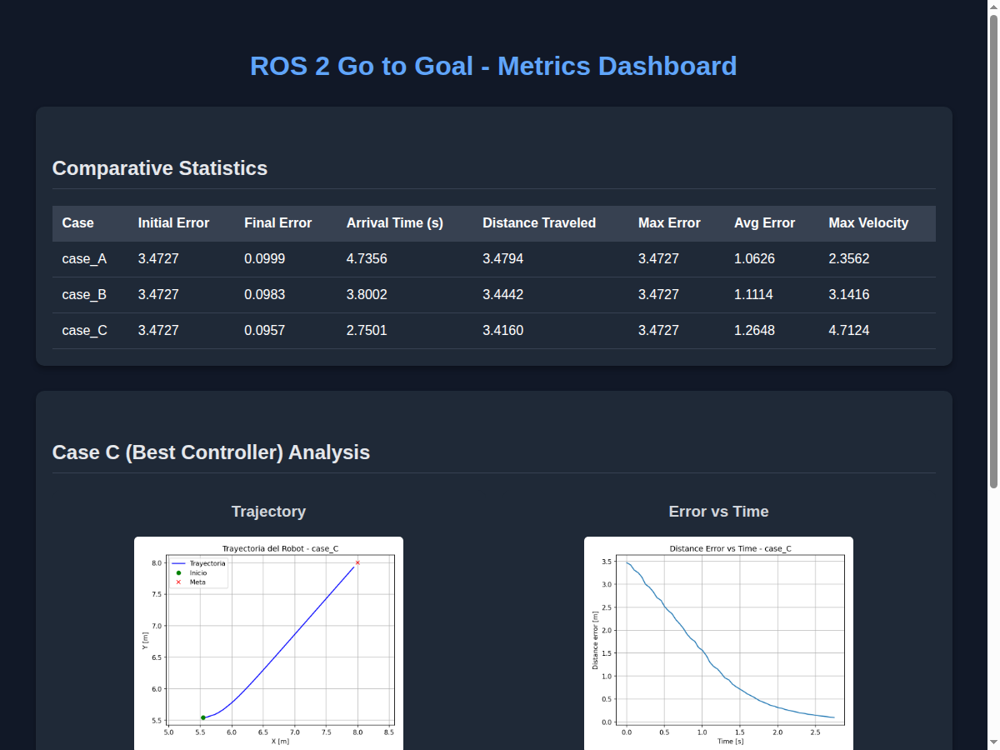

# Lab: Evaluación de desempeño de un controlador Go to Goal en ROS 2


Este repositorio contiene la implementación y el análisis de desempeño de un controlador Go to Goal para `turtlesim` en ROS 2.

## 🚀 Guía de Ejecución Rápida

Este proyecto ahora es un paquete oficial de ROS 2. Para ejecutarlo:

1. **Configurar el entorno:**
   Asegúrate de tener ROS 2 instalado y configurado.

2. **Ejecutar directamente (sin construir):**
   ```bash
   cd Go_To_Goal_Metrics/go_to_goal_metrics
   python3 turtle_go_to_goal_metrics.py --ros-args -p case_name:=case_A
   ```

3. **Ejecutar como paquete ROS 2 (Recomendado):**
   Copia la carpeta `Go_To_Goal_Metrics` a tu workspace de ROS 2 (ej. `~/ros2_ws/src`) y compila:
   ```bash
   cd ~/ros2_ws
   colcon build --packages-select go_to_goal_metrics
   source install/setup.bash
   ros2 run go_to_goal_metrics turtle_go_to_goal_metrics --ros-args -p case_name:=case_B
   ```

4. **Ver resultados:**
   Las métricas y gráficas se guardarán en la carpeta donde ejecutes el comando, dentro de `metrics_results/`.

---

## Objetivo

Analizar el desempeño de un controlador tipo **Go to Goal** en `turtlesim` mediante métricas cuantitativas, comparación de configuraciones y evaluación técnica del comportamiento del sistema.

En esta actividad se utilizará como base el laboratorio previamente desarrollado de **Go to Goal**. A partir de dicho controlador, el estudiante deberá extender el sistema para registrar, visualizar y analizar métricas de desempeño.

---

# Descripción general

En el laboratorio anterior se implementó un controlador tipo **Go to Goal** utilizando `turtlesim`.

En esta actividad NO se evaluará únicamente si la tortuga llega a la meta, sino qué tan buena es la solución implementada.

El objetivo es evaluar el desempeño del controlador utilizando métricas cuantitativas, análisis experimental y comparación entre distintas configuraciones del sistema.

---

# Código base

Utiliza como punto de partida el código desarrollado previamente en el laboratorio:

```text
turtle_go_to_goal.py
```

A partir de dicho código, desarrolla una nueva versión llamada:

```text
turtle_go_to_goal_metrics.py
```

---

# Escenario

Una plataforma robótica móvil debe desplazarse hacia una meta minimizando:

- tiempo de llegada,
- error final,
- oscilaciones,
- distancia recorrida,
- y movimientos innecesarios.

El controlador debe mantener un comportamiento estable y eficiente.

---

# Requerimientos del sistema

El controlador debe:

1. Llevar la tortuga desde cualquier posición inicial hacia una meta fija.
2. Detenerse automáticamente cuando el error sea menor a una tolerancia.
3. Mantener un movimiento estable.
4. Minimizar oscilaciones excesivas.
5. Registrar métricas de desempeño durante la trayectoria.

---

# Restricciones de diseño

Durante el desarrollo del controlador deben considerarse:

- precisión de llegada,
- estabilidad del movimiento,
- eficiencia de trayectoria,
- limitaciones de velocidad,
- comportamiento seguro y suave.
- tiempo para estabilizarse

---

# Meta sugerida

Usa como meta inicial:

```python
x_goal = 8.0
y_goal = 8.0
```

---

# Parte 1: Implementación del controlador con métricas

## Descripción

Implementa un nodo llamado:

```text
turtle_go_to_goal_metrics.py
```

El nodo debe:

1. Suscribirse al tópico `/turtle1/pose`
2. Publicar velocidades en `/turtle1/cmd_vel`
3. Calcular:
   - error de distancia,
   - ángulo deseado,
   - error angular.
4. Aplicar una ley de control proporcional:
   - velocidad lineal proporcional a la distancia,
   - velocidad angular proporcional al error angular.
5. Registrar métricas de desempeño durante la ejecución.

---

# Parte 2: Métricas obligatorias

El sistema debe calcular y mostrar las siguientes métricas:

| Métrica | Descripción |
|---|---|
| Error inicial | Distancia inicial a la meta |
| Error final | Distancia al terminar |
| Tiempo de llegada | Tiempo total hasta alcanzar la meta |
| Distancia recorrida | Longitud aproximada de la trayectoria |
| Error máximo | Mayor error registrado |
| Error promedio | Promedio del error durante la trayectoria |
| Número de oscilaciones | Cambios bruscos de dirección |
| Velocidad máxima | Máxima velocidad aplicada |

---

# Ejemplo de salida esperada

```text
Meta alcanzada.

Métricas de desempeño:
Error inicial: 3.52
Error final: 0.08
Tiempo de llegada: 4.81 s
Distancia recorrida: 4.20
Error máximo: 3.52
Error promedio: 1.35
Oscilaciones detectadas: 2
Velocidad máxima: 2.00
```

---

# Parte 3: Comparación de soluciones

Prueba el controlador con al menos tres configuraciones diferentes

---

# Parte 4: Tabla comparativa y Estadísticas



A continuación se presentan los resultados consolidados de las métricas obtenidas durante nuestras simulaciones en ROS 2.

| Caso | k_linear | k_angular | Tiempo | Error final | Distancia recorrida | Oscilaciones | Observaciones |
|---|---:|---:|---:|---:|---:|---:|---|
| A | 0.8 | 3.0 | 5.3507 s | 0.0981 m | 3.4810 m | 0 | Llega a la meta de forma estable y suave, pero es el más lento. |
| B | 1.0 | 4.0 | 3.8991 s | 0.0956 m | 3.4500 m | 0 | Balance razonable entre velocidad y estabilidad. |
| C | 1.5 | 6.0 | 2.7505 s | 0.0980 m | 3.4134 m | 0 | El más rápido de los tres, sin comprometer la estabilidad; el control es más agresivo. |

---

# Parte 5: Visualización y análisis experimental

Durante los experimentos, se registraron y analizaron datos del sistema utilizando las herramientas de la base de código.

A continuación se muestran las gráficas obtenidas para los distintos casos evaluados:

### Caso A: k_linear=0.8, k_angular=3.0
- **Trayectoria**: 

- **Error vs Tiempo**: 

- **Velocidad Lineal**: 

- **Velocidad Angular**: 


### Caso B: k_linear=1.0, k_angular=4.0
- **Trayectoria**: 

- **Error vs Tiempo**: 

- **Velocidad Lineal**: 

- **Velocidad Angular**: 


### Caso C: k_linear=1.5, k_angular=6.0
- **Trayectoria**: 

- **Error vs Tiempo**: 

- **Velocidad Lineal**: 

- **Velocidad Angular**: 


---

# Parte 6: Análisis de ingeniería

## Identify

1. **¿Cuáles son los objetivos principales del controlador?**
   El objetivo principal es lograr que el robot móvil (Turtlesim) se desplace hacia una meta fija `(x_goal, y_goal)` partiendo desde cualquier posición inicial, minimizando el error posicional de manera autónoma. Además, el movimiento debe ser estable, eficiente y capaz de detenerse automáticamente al alcanzar una precisión aceptable (error < tolerancia).

2. **¿Qué restricciones de diseño identificaste?**
   - El robot es no holonómico (sólo avanza hacia adelante y rota), lo que implica que debe alinear su ángulo (`theta`) antes de avanzar efectivamente hacia la meta.
   - Las velocidades máximas del sistema están limitadas para evitar comportamientos erráticos.
   - Existe un compromiso entre la rapidez para llegar (altas velocidades) y la estabilidad (evitar oscilaciones y "overshoot").
   - Es necesario mantener un movimiento suave y seguro sin oscilaciones excesivas que desgastarían los actuadores.

---

## Analyze

3. **¿Cómo afectan las ganancias del controlador al desempeño?**
   - El aumento de la ganancia proporcional lineal (`k_linear`) hace que el robot reaccione más rápido para reducir la distancia (acelera más), reduciendo el tiempo total pero pudiendo causar inestabilidad (overshoot) si no está balanceado.
   - El aumento de la ganancia proporcional angular (`k_angular`) acelera la corrección de orientación del robot hacia el punto deseado. Un valor alto ayuda a alinear rápido y evitar "arcos" largos, pero si es demasiado alto, el robot puede oscilar en torno a la orientación deseada.

4. **¿Qué métricas fueron más importantes para evaluar el sistema?**
   Las métricas más relevantes fueron:
   - **Tiempo de llegada**: para medir la agilidad del sistema.
   - **Error final**: para validar la precisión al detenerse.
   - **Oscilaciones**: porque indican directamente la estabilidad y el consumo eficiente del controlador.

---

## Develop Solutions

5. **¿Qué estrategia utilizaste para mejorar el controlador?**
   Aumentar las ganancias de control de forma empírica y analizar los resultados visualmente (gráficas de velocidad y error) y métricamente (tiempos y distancia recorrida). Se ajustaron $k_l$ y $k_a$ manteniendo una proporción en la cual la alineación sea rápida para optimizar el trayecto final rectilíneo.

6. **¿Qué combinación de ganancias produjo el mejor resultado?**
   La combinación del **Caso C ($k_l=1.5, k_a=6.0$)** produjo el mejor resultado. Proporcionó el tiempo más corto de llegada (2.75s) manteniendo cero oscilaciones notables y un error de distancia que converge limpiamente sin salirse de la ruta.

---

## Evaluate Solutions

7. **¿Qué controlador tuvo mejor desempeño y por qué?**
   El controlador del **Caso C** obtuvo el mejor desempeño general porque redujo el tiempo de llegada a casi la mitad comparado con el caso base, no incrementó la distancia recorrida significativamente, mantuvo un error final de 0.098 m y demostró ser el más ágil para alinear la dirección del robot con la meta.

8. **¿Qué trade-offs observaste entre rapidez y estabilidad?**
   En el controlador del Caso C, las velocidades angulares alcanzan picos más altos inicialmente (movimiento agresivo). Aunque esto resulta en una convergencia más rápida, en un entorno físico implicaría mayor torque instantáneo, lo que puede provocar deslizamiento en las ruedas de un robot real.

---

## Sustainability

9. **¿Por qué minimizar oscilaciones y trayectorias innecesarias puede ser importante en robots reales?**
   En la vida real, cada oscilación se traduce en movimientos repetitivos de los motores, lo que provoca desgaste excesivo de los engranes, mayor fricción, calentamiento y un comportamiento impredecible que es peligroso cerca de humanos o de equipos valiosos.

10. **¿Cómo impacta la eficiencia de movimiento en:**
   - **consumo energético:** Movimientos suaves y directos conservan la carga de las baterías, alargando la autonomía del robot.
   - **desgaste mecánico:** Trayectorias sin cambios bruscos de dirección extienden la vida útil de motores y transmisiones.
   - **seguridad:** Un movimiento directo y predecible reduce enormemente el riesgo de colisión.
   - **sostenibilidad:** Alargar la vida útil de los componentes y optimizar el uso de energía se alinea con la meta de producir tecnología duradera, reduciendo la generación de residuos electrónicos y consumo general.

---

# Entregables

El repositorio debe incluir:

```text
turtle_go_to_goal_metrics.py
analysis.md
README.md (este archivo)
```

---

# Instrucciones de entrega

- Utiliza como base el laboratorio anterior de Go to Goal.
- Completa todos los archivos solicitados.
- Realiza commits claros y ordenados.
- Verifica el funcionamiento del controlador antes del último push.
- Incluye análisis técnico y justificación de decisiones.
- Agregar los hallazgos a la entrega individual.
